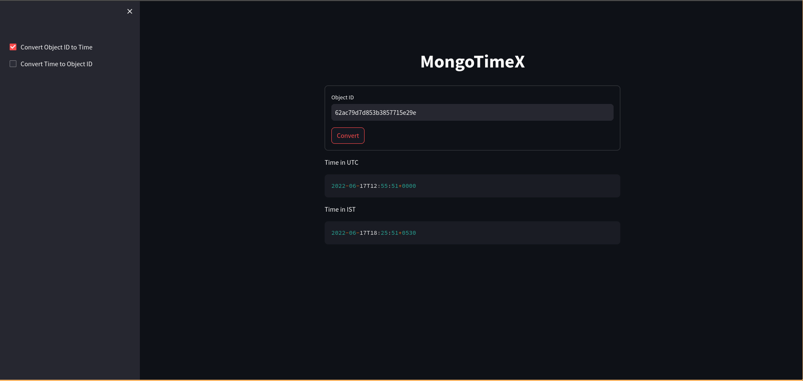
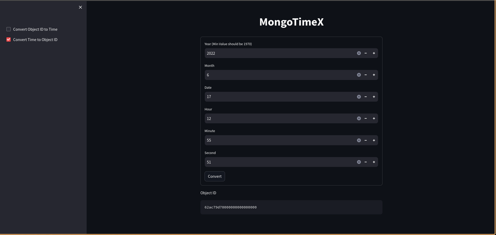

# MongoTimeX

MongoTimeX is a versatile tool that simplifies the conversion between MongoDB ObjectID and time in ISO format. With a user-friendly interface built using Streamlit and powerful Python functionality under the hood, MongoTimeX empowers you to seamlessly switch between MongoDB ObjectID and time representations in both UTC and IST.

## Features

1. **ObjectID to Time Conversion:**
   - Convert MongoDB ObjectID to time in ISO format.
   - Choose between UTC and IST time zones.

2. **Time to ObjectID Conversion:**
   - Convert time in ISO format to MongoDB ObjectID.
   - Ensure accuracy with support for both UTC and IST time zones.

3. **Streamlit Interface:**
   - Intuitive user interface powered by Streamlit for a seamless user experience.
   - Easily navigate through the conversion options with a clean and responsive design.

## Getting Started

1. **Installation:**
   - Clone the repository: `git clone https://github.com/shubham16sky/MongoTimeX.git`
   - Install dependencies: `pip install -r requirements.txt`

2. **Run the Application:**
   - Navigate to the project directory: `cd MongoTimeX`
   - Run the Streamlit app: `streamlit run app.py`

3. **Usage:**
   - Open the provided URL in your browser to access the MongoTimeX interface.
   - Choose the desired conversion option and input the required information.
   - View the converted result instantly!

## Screenshots

## Contributors

- [@shubham16sky](https://github.com/shubham16sky)

